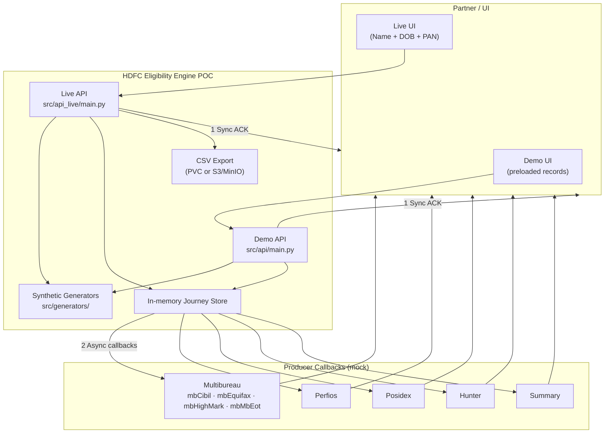
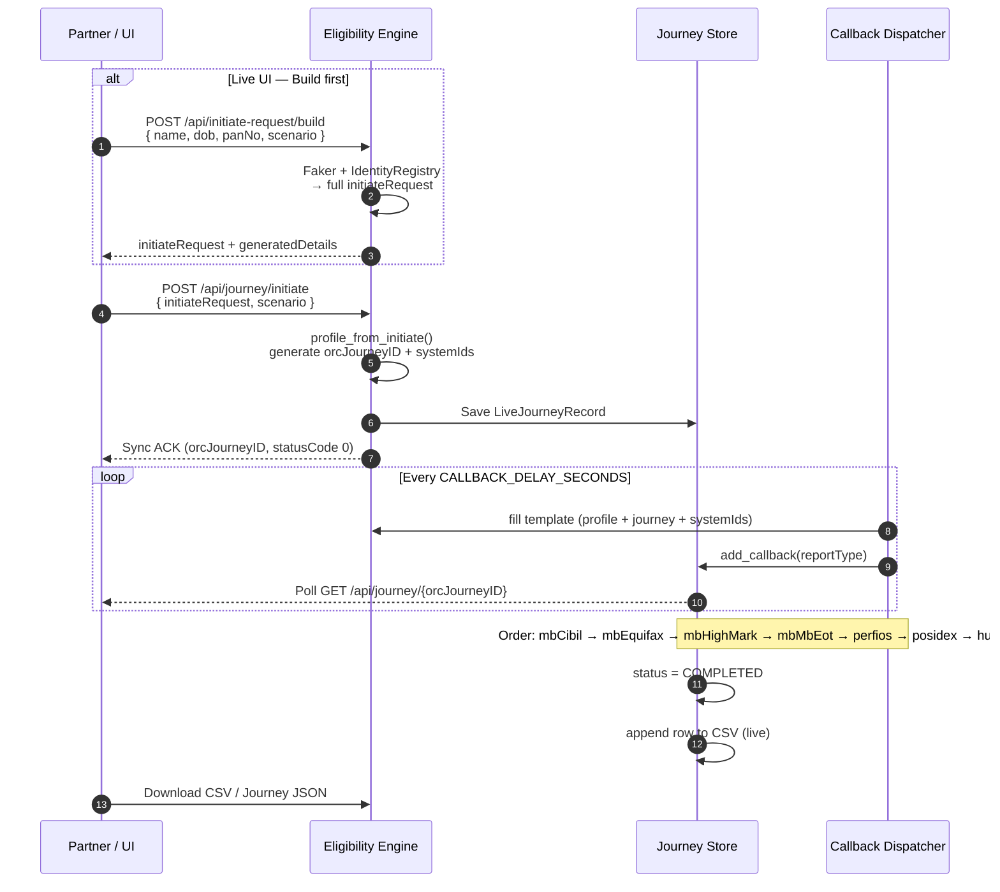
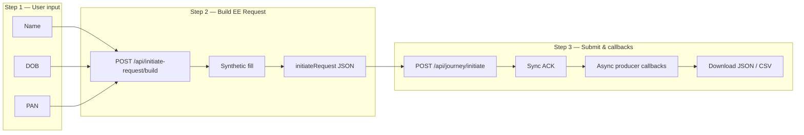
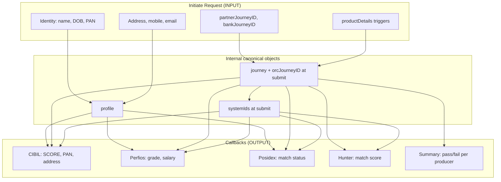
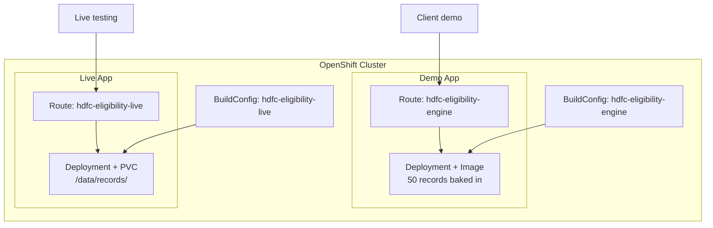

# HDFC Eligibility Engine POC — Approach & Architecture

**Purpose:** Mock Producer API for loan eligibility testing — synthetic customer data, EE spec-compliant JSON, and async producer callbacks (CIBIL, Perfios, Posidex, Hunter, Summary).

**Audience:** Client demo, QA, and engineering review.

**Authoritative spec sources:** `EligibilityEngine_SpecDoc_SampleFiles/`, `ACE BRE Generic API Spec.pdf`, `Requirement_MockAPI.txt`

---

## 1. Problem & Approach

### What we simulate

HDFC’s Eligibility Engine sits between a **Partner** (loan origination channel) and multiple **producer systems** (bureau, income, dedupe, fraud). The Partner sends an **Initiate Journey** request; the Engine returns a synchronous **ACK**, then delivers **async callbacks** as each producer completes.

This POC does **not** call real bureaus or bank systems. Instead it:

1. **Accepts** EE-spec initiate JSON (or builds it from minimal identity input).
2. **Generates** synthetic demographics, addresses, IDs, and producer responses.
3. **Keeps one canonical profile** so PAN, name, DOB, and address match across initiate and every callback.
4. **Returns** ACK + timed async callbacks in the order defined by `productDetails`.
5. **Exports** journey results to CSV (live app) for audit and demo replay.

All data is **fake and for testing only**.

### Design principles

| Principle | Implementation |
|-----------|----------------|
| **Spec fidelity** | JSON templates copied verbatim from EE sample files; field names unchanged (`panNo`, `fName`, `APPLICATION-ID`) |
| **Single source of truth** | Internal `profile` object parsed from initiate (or built by Faker); all callbacks filled from it |
| **Scenario-driven behaviour** | `data/scenarios/*.json` overrides scores, Hunter matches, summary pass/fail |
| **Unique synthetic IDs** | `IdentityRegistry` per build; fresh `orcJourneyID` per submit; batch audit for 100-record runs |
| **Two UX modes** | **Demo** — preloaded records; **Live** — identity-first generation on demand |

---

## 2. High-Level Architecture



---

## 3. Journey Flow (Runtime)



**Callback order** is derived from `applicant.productDetails`:

| `productDetails` key | Callbacks (`reportType`) |
|----------------------|--------------------------|
| `multibureau` | mbCibil, mbEquifax, mbHighMark, mbMbEot |
| `perfios` | perfios |
| `posidex` | posidex |
| `hunter` | hunter |
| (always last) | summary |

Default delay: `CALLBACK_DELAY_SECONDS=3` (configurable; use `120` for spec 2-minute think time).

---

## 4. Live App — Identity-First Approach

The live UI minimises partner input to three fields. Everything else is synthesized while preserving EE JSON structure.



### What the user provides vs what is generated

| User provides | Generated synthetically |
|---------------|-------------------------|
| Name (fName / lName) | Address lines 1–4, city, state, pinCode |
| DOB | Age, gender (inferred), email, mobile |
| PAN | customerId, loanAmount, employerName |
| Scenario (behaviour) | partnerJourneyID, bankJourneyID, co-applicant block, productDetails IDs |
| | Perfios txnId in initiate; multibureau IDs at submit |

---

## 5. Data Consistency Model

One internal **profile** drives all producer payloads. Journey **contextParameter** IDs link initiate, ACK, and callbacks.



### ID lifecycle

| ID | When assigned | Consistency rule |
|----|---------------|------------------|
| `partnerJourneyID`, `bankJourneyID` | Build (live) or batch generate | Same in initiate, ACK, all callbacks |
| `orcJourneyID` | **Submit only** (not in initiate per spec) | Same in ACK + all callbacks |
| `customerId`, PAN, mobile, email | Build | Applicant ≠ co-applicant; PAN from user in live flow |
| Multibureau applicationId, tracking IDs | Submit | One set per journey, reused across bureau callbacks |
| Perfios `perfiosTransactionId` | Build (in initiate) | Callback reads from initiate `productDetails` |

**Uniqueness:** `IdentityRegistry` prevents duplicate PAN, mobile, email, customerId, and journey IDs within a single build. Each **Build** uses a new timestamp seed. Each **Submit** generates a new `orcJourneyID` (UUID + timestamp). Batch script (`generate_customers.py -n 100`) runs a cross-record audit.

---

## 6. Software Component Map

```
HDFC_Bank_POC/
├── EligibilityEngine_SpecDoc_SampleFiles/   # Authoritative JSON samples
├── data/
│   ├── templates/                           # Copied spec templates for fillers
│   └── scenarios/                           # Behaviour overrides (5 scenarios)
├── src/
│   ├── generators/                          # Core synthetic data engine
│   │   ├── customer.py                      # Profile + journey context
│   │   ├── live_record.py                   # Build initiate from identity
│   │   ├── spec_builder.py                  # initiateRequest + ackResponse
│   │   ├── template_filler.py               # All producer callbacks
│   │   ├── system_ids.py                    # Journey & bureau ID generators
│   │   ├── uniqueness.py                    # IdentityRegistry
│   │   └── validate.py                      # Cross-payload PAN/score checks
│   ├── api/                                 # Demo API + initiate parser
│   │   ├── main.py
│   │   └── initiate_parser.py               # initiate → profile + journey
│   └── api_live/                            # Live API + CSV export
│       ├── main.py
│       ├── journey_service.py               # Async callback dispatch
│       └── csv_export.py
├── ui/                                      # Demo UI (preloaded records)
├── ui_live/                                 # Live UI (identity-first)
├── scripts/generate_customers.py            # Batch: 100 records CLI
├── openshift/
│   ├── deploy.yaml                          # Demo deployment
│   └── deploy-live.yaml                     # Live deployment + PVC
└── docs/                                    # This document
```

### Generation pipeline (batch / internal)

```
scenario → Faker identity → IdentityRegistry → system IDs
    → fill spec template (initiate + ACK + callbacks) → validate_record()
```

---

## 7. Deployment Architecture (OpenShift)

Two independent deployments share generator code but serve different use cases.



| App | Image / Dockerfile | UI | Data |
|-----|-------------------|-----|------|
| **Demo** | `Dockerfile` | `ui/` — pick preloaded record | 50 records at build time |
| **Live** | `Dockerfile.live` | `ui_live/` — Name + DOB + PAN | On-the-fly generate + CSV on PVC |

**Live URLs (sandbox example):**

- Demo: `https://hdfc-eligibility-engine-default.apps.ocp.8v2x7.sandbox1891.opentlc.com`
- Live: `https://hdfc-eligibility-live-default.apps.ocp.8v2x7.sandbox1891.opentlc.com`

**Local run:**

```bash
# Demo
.venv/bin/python scripts/run_server.py          # http://localhost:8000

# Live
.venv/bin/pip install -r requirements-live.txt
.venv/bin/uvicorn src.api_live.main:app --port 8080
```

---

## 8. Scenarios (Test Behaviours)

Files in `data/scenarios/` control producer outcomes without changing JSON shape:

| Scenario | Typical use |
|----------|----------------|
| `clean-approval` | All producers pass; high CIBIL score |
| `bureau-not-found` | CIBIL subject not found |
| `low-score-decline` | Low bureau score |
| `fraud-hit` | Hunter match |
| `partial-failure` | Mixed pass/fail in summary |

Selected in the Live UI before **Build EE Request**; passed through to callback fillers.

---

## 9. API Summary (Live)

| Method | Path | Purpose |
|--------|------|---------|
| POST | `/api/initiate-request/build` | Name + DOB + PAN → full `initiateRequest` |
| POST | `/api/journey/initiate` | Submit initiate → ACK + start callbacks |
| GET | `/api/journey/{orcJourneyID}` | Poll status + received callbacks |
| GET | `/api/export/csv` | Download accumulated results CSV |
| GET | `/api/journey/{orcJourneyID}/export` | Download full journey JSON |

---

## 10. What Is In Scope vs Out of Scope

| In scope | Out of scope |
|----------|--------------|
| EE spec JSON structure for initiate, ACK, callbacks | Real bureau / Perfios / Hunter integration |
| Synthetic Faker `en_IN` identity and addresses | Production-grade persistence (DB) |
| Identity consistency across producers | Global cross-session ID registry (optional future) |
| CSV export of journey outcomes | Real credit decisions |
| OpenShift deploy for demo + live | ACE BRE rule engine execution |

---

## 11. Related Documents

| Document | Location |
|----------|----------|
| Client Q&A / understanding | `docs/EligibilityEngine_Understanding_and_Client_Questions.txt` |
| Field schemas | `.cursor/skills/hdfc-eligibility-engine/schemas.md` |
| Generator → spec mappings | `.cursor/skills/hdfc-eligibility-engine/mappings.md` |
| OpenShift deploy (demo) | `openshift/README.md` |
| OpenShift deploy (live) | `openshift/README-live.md` |
| Agent entry point | `AGENTS.md` |

---

*Last updated: June 2026 — reflects Live UI identity-first flow, download endpoints, and dual OpenShift deployment.*
